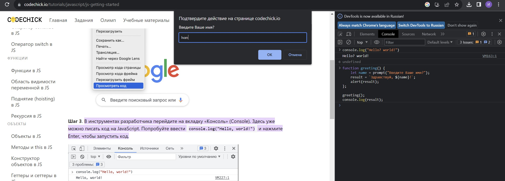
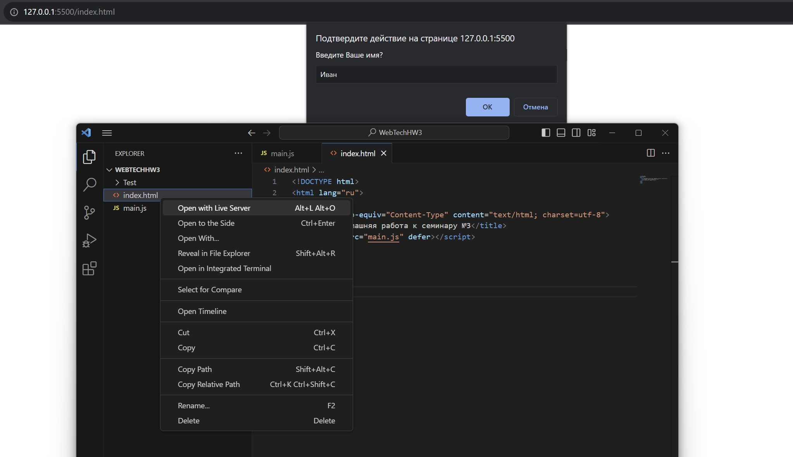
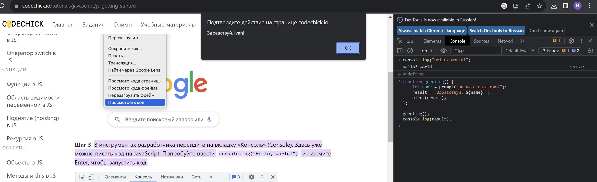
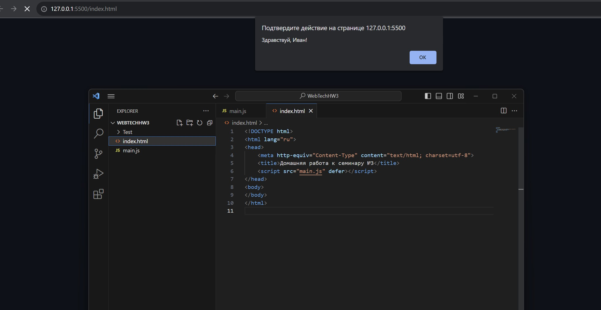

# Web_TechnologiesHW3

## Задача 

Необходимо создать html-страницу с названием index.html, в которой подключить файл main.js (его тоже необходимо создать рядом с html-файлом). В js-файле необходимо создать следующий скрипт:

Cоздать функцию greeting, которая принимает в качестве параметра имя человека и выводит приветствие, используя переданное ей имя, в консоль.

Необходимо продемонстрировать работу функции: у пользователя запросить его имя и вызвать функцию greeting, передав туда полученное от пользователя значение.

# Запросили/Вызвали

Браузер (Chrome)

Live Server (VS Code)

# Вернули Приветствие

Браузер (Chrome)

Live Server (VS Code)

